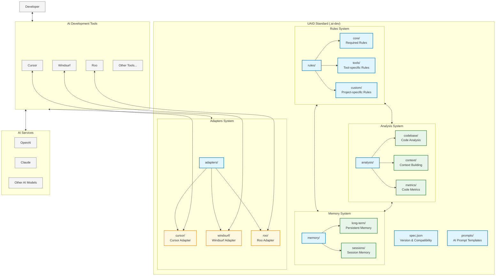

# UAID Architecture Diagram

## Key Components Explained

### Core Components

- **spec.json**: Defines UAID version and compatibility information
- **Rules System**: Defines how code is analyzed and understood
- **Analysis System**: Stores results of code analysis and context building
- **Memory System**: Stores interaction history and project knowledge
- **Adapters System**: Provides compatibility with different AI development tools
- **Prompts**: Templates for generating AI prompts

### External Components

- **AI Development Tools**: Tools like Cursor, Windsurf, and Roo that integrate with UAID
- **AI Services**: AI models and services that provide intelligence
- **Developer**: The human developer using the tools

### Relationships

- Developers interact with AI Development Tools
- Tools connect to UAID through Adapters
- Tools also connect to AI Services for intelligence
- Within UAID, the Rules, Analysis, and Memory systems interact to provide comprehensive context
- Each tool has its own Adapter that translates between the tool and UAID
