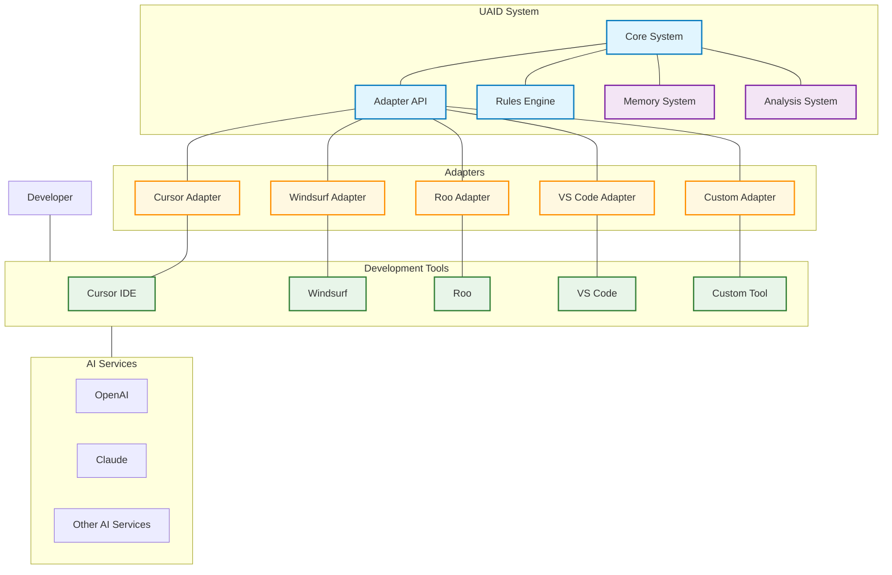
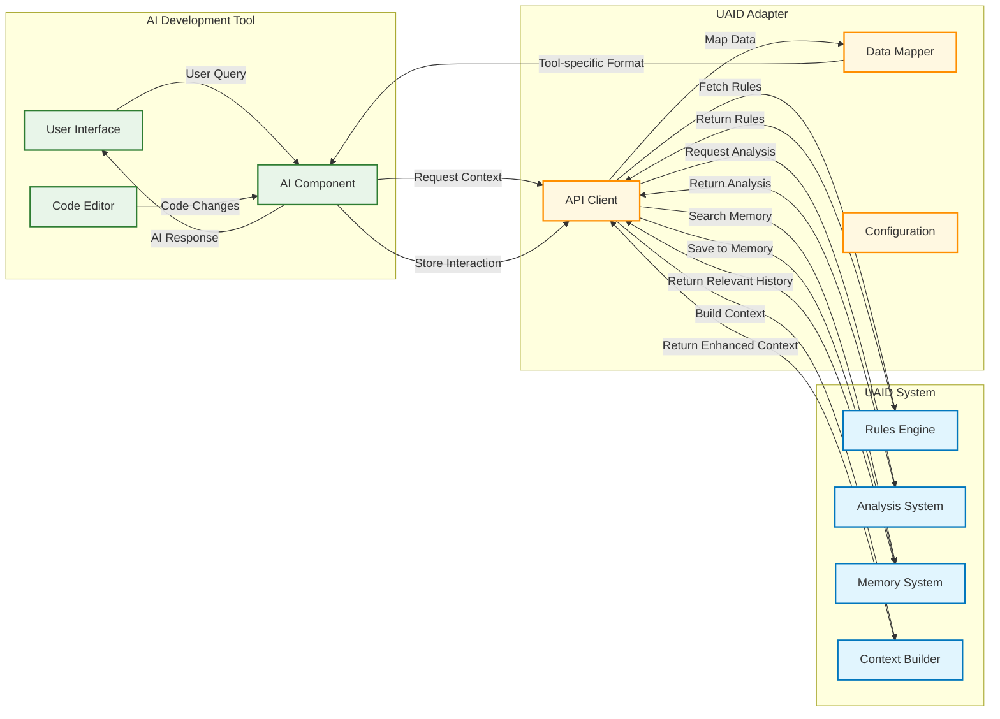
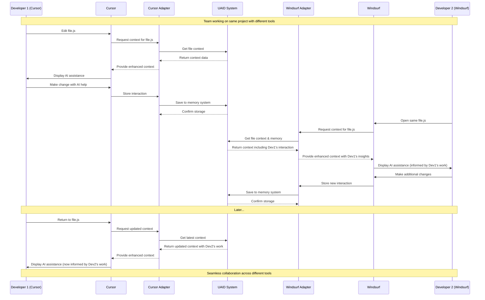
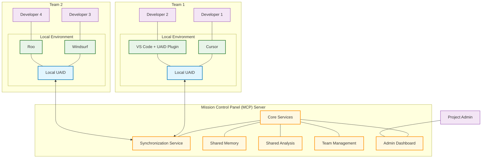
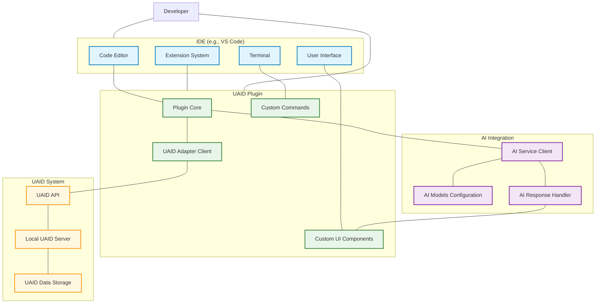

# UAID Integration Diagrams

These diagrams illustrate how UAID integrates with different tools and environments.

## Tool Integration Architecture

## Data Flow Between Components

## Multi-Tool Collaboration Scenario

## Phase 3: MCP Integration Architecture

## IDE Plugin Integration

