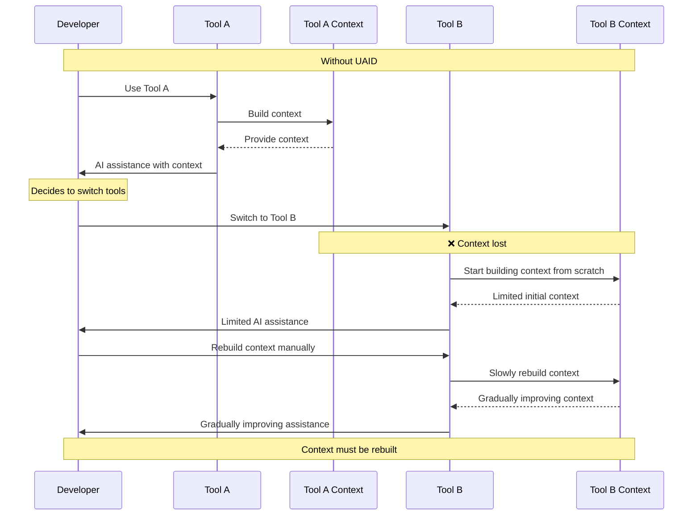
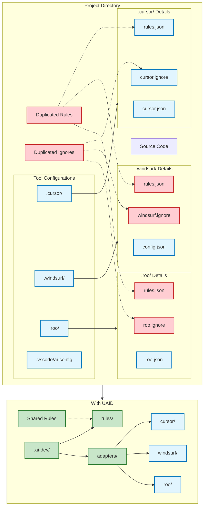
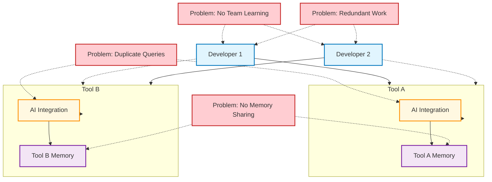
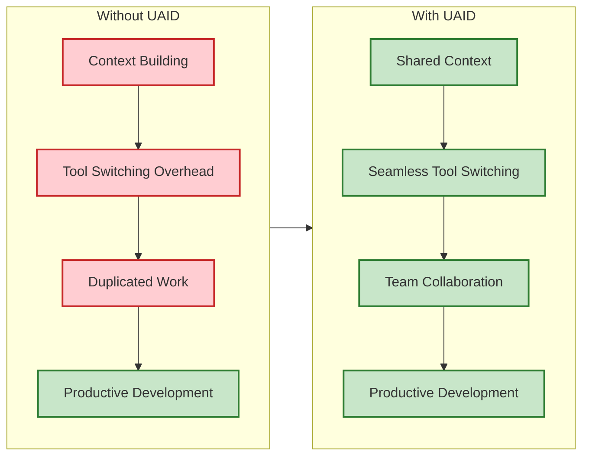
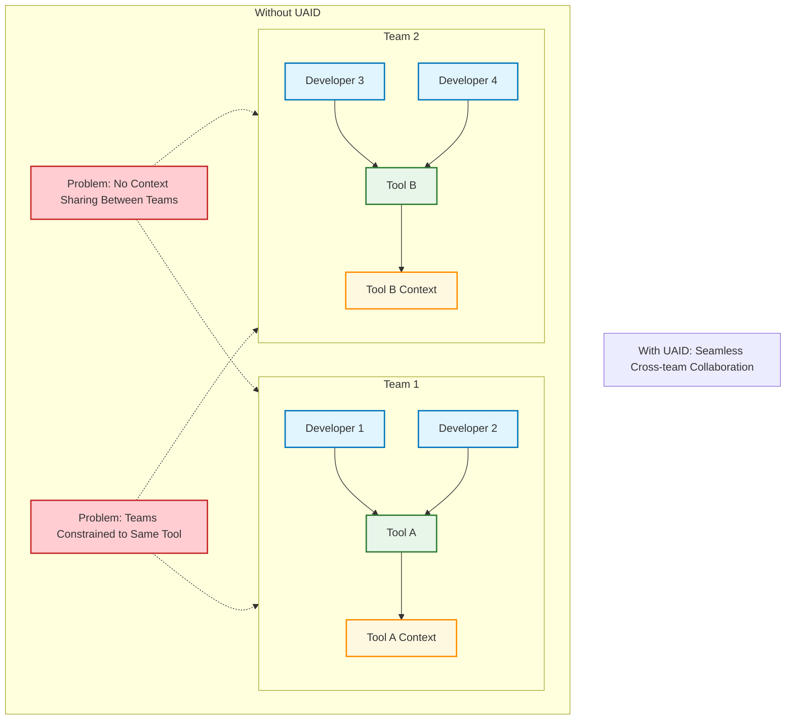

# Problem Statement Diagrams

These diagrams illustrate the problems that UAID aims to solve.

## The Current AI Development Tool Landscape

```mermaid
flowchart TD
    classDef tools fill:#e1f5fe,stroke:#0277bd,stroke-width:2px
    classDef configs fill:#e8f5e9,stroke:#2e7d32,stroke-width:2px
    classDef context fill:#fff8e1,stroke:#ff8f00,stroke-width:2px
    classDef dev fill:#f3e5f5,stroke:#7b1fa2,stroke-width:2px
    
    Developer["Developer"]:::dev
    
    subgraph Cursor["Cursor"]
        CursorTool["Cursor Tool"]:::tools
        CursorConfig[".cursor/ Config"]:::configs
        CursorContext["Cursor Context"]:::context
    end
    
    subgraph Windsurf["Windsurf"]
        WindsurfTool["Windsurf Tool"]:::tools
        WindsurfConfig[".windsurf/ Config"]:::configs
        WindsurfContext["Windsurf Context"]:::context
    end
    
    subgraph Roo["Roo"]
        RooTool["Roo Tool"]:::tools
        RooConfig[".roo/ Config"]:::configs
        RooContext["Roo Context"]:::context
    end
    
    subgraph VSCode["VS Code + AI Extension"]
        VSCodeTool["VS Code"]:::tools
        VSCodeConfig[".vscode/ Config"]:::configs
        VSCodeContext["Extension Context"]:::context
    end
    
    %% Developer connections to tools
    Developer --> Cursor
    Developer -.-> Windsurf
    Developer -.-> Roo
    Developer -.-> VSCode
    
    %% No connections between tools
    
    %% Problem callouts
    DuplicateConfig["Problem: Duplicate Configurations"]
    DuplicateConfig -.-> CursorConfig
    DuplicateConfig -.-> WindsurfConfig
    DuplicateConfig -.-> RooConfig
    DuplicateConfig -.-> VSCodeConfig
    
    NoSharedContext["Problem: No Shared Context"]
    NoSharedContext -.-> CursorContext
    NoSharedContext -.-> WindsurfContext
    NoSharedContext -.-> RooContext
    NoSharedContext -.-> VSCodeContext
    
    ContextLoss["Problem: Context Loss When Switching Tools"]
    ContextLoss -.-> Developer
    
    LockIn["Problem: Tool Lock-in"]
    LockIn -.-> Developer
    
    TeamFragmentation["Problem: Team Fragmentation"]
    TeamFragmentation -.-> Developer
```

## Context Loss When Switching Tools

## Project Configuration Duplication

## AI Interaction Silos

## The Impact on Development Speed

## Team Collaboration Challenges

