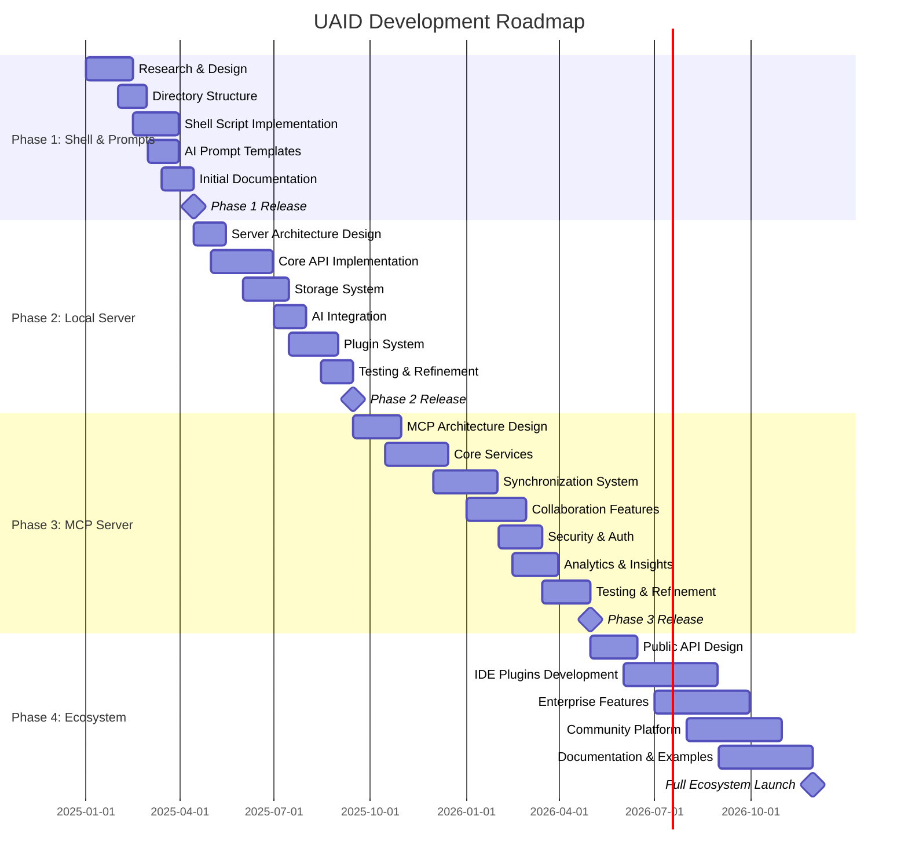
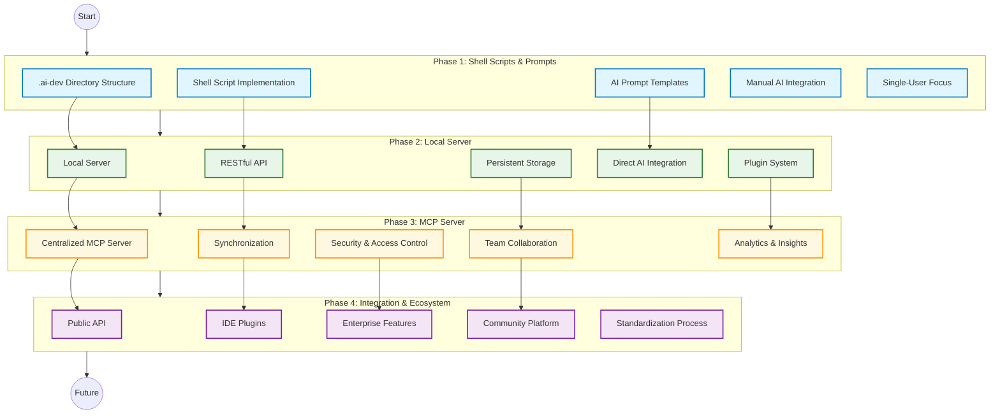
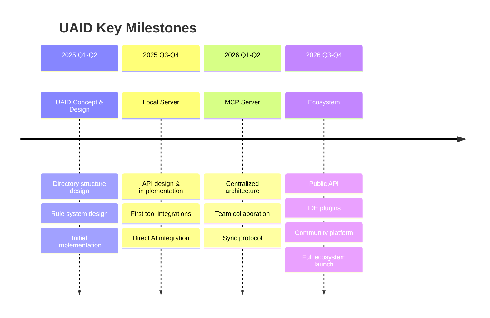

# UAID Development Roadmap Diagram

```mermaid
gantt
    title UAID Development Roadmap
    dateFormat  YYYY-MM-DD
    
    section Phase 1: Shell & Prompts
    Research & Design           :p1_design, 2025-01-01, 2025-02-15
    Directory Structure         :p1_dir, 2025-02-01, 2025-02-28
    Shell Script Implementation :p1_shell, 2025-02-15, 2025-03-31
    AI Prompt Templates         :p1_prompts, 2025-03-01, 2025-03-31
    Initial Documentation       :p1_docs, 2025-03-15, 2025-04-15
    Phase 1 Release             :milestone, p1_release, 2025-04-15, 0d
    
    section Phase 2: Local Server
    Server Architecture Design  :p2_design, after p1_release, 2025-05-15
    Core API Implementation     :p2_core, 2025-05-01, 2025-06-30
    Storage System              :p2_storage, 2025-06-01, 2025-07-15
    AI Integration              :p2_ai, 2025-07-01, 2025-07-31
    Plugin System               :p2_plugins, 2025-07-15, 2025-08-31
    Testing & Refinement        :p2_testing, 2025-08-15, 2025-09-15
    Phase 2 Release             :milestone, p2_release, 2025-09-15, 0d
    
    section Phase 3: MCP Server
    MCP Architecture Design     :p3_design, after p2_release, 2025-10-31
    Core Services               :p3_core, 2025-10-15, 2025-12-15
    Synchronization System      :p3_sync, 2025-12-01, 2026-01-31
    Collaboration Features      :p3_collab, 2026-01-01, 2026-02-28
    Security & Auth             :p3_security, 2026-02-01, 2026-03-15
    Analytics & Insights        :p3_analytics, 2026-02-15, 2026-03-31
    Testing & Refinement        :p3_testing, 2026-03-15, 2026-04-30
    Phase 3 Release             :milestone, p3_release, 2026-04-30, 0d
    
    section Phase 4: Ecosystem
    Public API Design           :p4_api, after p3_release, 2026-06-15
    IDE Plugins Development     :p4_plugins, 2026-06-01, 2026-08-31
    Enterprise Features         :p4_enterprise, 2026-07-01, 2026-09-30
    Community Platform          :p4_community, 2026-08-01, 2026-10-31
    Documentation & Examples    :p4_docs, 2026-09-01, 2026-11-30
    Full Ecosystem Launch       :milestone, p4_release, 2026-11-30, 0d
```

## Phase Comparison Diagram

```mermaid
flowchart TD
    classDef phase1 fill:#e1f5fe,stroke:#0277bd,stroke-width:2px
    classDef phase2 fill:#e8f5e9,stroke:#2e7d32,stroke-width:2px
    classDef phase3 fill:#fff8e1,stroke:#ff8f00,stroke-width:2px
    classDef phase4 fill:#f3e5f5,stroke:#7b1fa2,stroke-width:2px
    
    subgraph Phase1["Phase 1: Shell Scripts & Prompts"]
        P1Dir[".ai-dev Directory Structure"]:::phase1
        P1Shell["Shell Script Implementation"]:::phase1
        P1Prompts["AI Prompt Templates"]:::phase1
        P1Manual["Manual AI Integration"]:::phase1
        P1Single["Single-User Focus"]:::phase1
    end
    
    subgraph Phase2["Phase 2: Local Server"]
        P2Server["Local Server"]:::phase2
        P2API["RESTful API"]:::phase2
        P2Storage["Persistent Storage"]:::phase2
        P2AI["Direct AI Integration"]:::phase2
        P2Plugins["Plugin System"]:::phase2
    end
    
    subgraph Phase3["Phase 3: MCP Server"]
        P3Server["Centralized MCP Server"]:::phase3
        P3Sync["Synchronization"]:::phase3
        P3Collab["Team Collaboration"]:::phase3
        P3Security["Security & Access Control"]:::phase3
        P3Analytics["Analytics & Insights"]:::phase3
    end
    
    subgraph Phase4["Phase 4: Integration & Ecosystem"]
        P4API["Public API"]:::phase4
        P4Plugins["IDE Plugins"]:::phase4
        P4Enterprise["Enterprise Features"]:::phase4
        P4Community["Community Platform"]:::phase4
        P4Standard["Standardization Process"]:::phase4
    end
    
    %% Connections between phases
    P1Dir --> P2Server
    P1Shell --> P2API
    P1Prompts --> P2AI
    
    P2Server --> P3Server
    P2API --> P3Sync
    P2Storage --> P3Collab
    P2Plugins --> P3Analytics
    
    P3Server --> P4API
    P3Sync --> P4Plugins
    P3Collab --> P4Community
    P3Security --> P4Enterprise
    
    %% Timeline
    Start((Start)) --> Phase1
    Phase1 --> Phase2
    Phase2 --> Phase3
    Phase3 --> Phase4
    Phase4 --> Future((Future))
```

## Technology Stack Evolution

```mermaid
flowchart LR
    classDef tech1 fill:#e1f5fe,stroke:#0277bd,stroke-width:2px
    classDef tech2 fill:#e8f5e9,stroke:#2e7d32,stroke-width:2px
    classDef tech3 fill:#fff8e1,stroke:#ff8f00,stroke-width:2px
    classDef tech4 fill:#f3e5f5,stroke:#7b1fa2,stroke-width:2px
    
    subgraph Phase1["Phase 1"]
        Bash["Bash Scripts"]:::tech1
        JSON1["JSON Files"]:::tech1
        Manual["Manual Workflow"]:::tech1
    end
    
    subgraph Phase2["Phase 2"]
        Node["Node.js"]:::tech2
        Express["Express.js"]:::tech2
        SQLite["SQLite"]:::tech2
        REST["REST API"]:::tech2
    end
    
    subgraph Phase3["Phase 3"]
        Server["Server Architecture"]:::tech3
        MongoDB["MongoDB"]:::tech3
        WebSocket["WebSockets"]:::tech3
        Auth["Auth System"]:::tech3
    end
    
    subgraph Phase4["Phase 4"]
        Cloud["Cloud Infrastructure"]:::tech4
        SDK["Client SDKs"]:::tech4
        Extensions["IDE Extensions"]:::tech4
        API["Public API"]:::tech4
    end
    
    Phase1 --> Phase2
    Phase2 --> Phase3
    Phase3 --> Phase4
```

## Key Milestones

```mermaid
timeline
    title UAID Key Milestones
    
    section 2025 Q1-Q2
        UAID Concept & Design : Directory structure design
        : Rule system design
        : Initial implementation
    
    section 2025 Q3-Q4
        Local Server : API design & implementation
        : First tool integrations
        : Direct AI integration
    
    section 2026 Q1-Q2
        MCP Server : Centralized architecture
        : Team collaboration
        : Sync protocol
    
    section 2026 Q3-Q4
        Ecosystem : Public API
        : IDE plugins
        : Community platform
        : Full ecosystem launch
```
