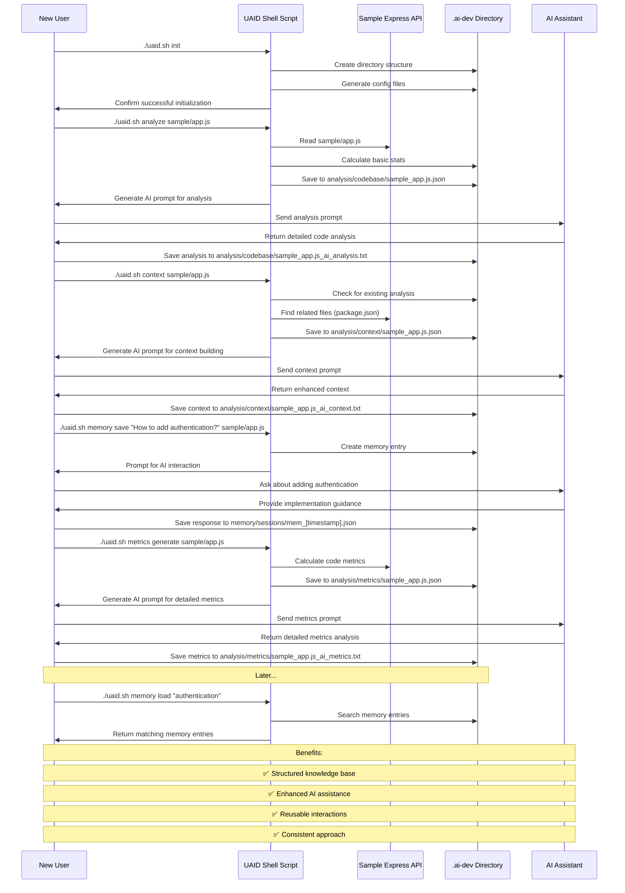
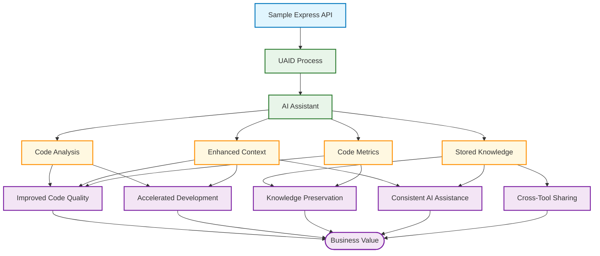

# Sample Application Workflow

This diagram illustrates the step-by-step process of using UAID with the sample Express API application.

## Complete UAID Workflow with Sample Application

## Directory Structure After Complete Workflow

```mermaid
flowchart TD
    classDef core fill:#e1f5fe,stroke:#0277bd,stroke-width:2px
    classDef analysis fill:#e8f5e9,stroke:#2e7d32,stroke-width:2px
    classDef memory fill:#fff8e1,stroke:#ff8f00,stroke-width:2px
    classDef rules fill:#f3e5f5,stroke:#7b1fa2,stroke-width:2px
    
    Root["uaid-implementation/"]
    
    AIDir[".ai-dev/"]:::core
    Sample["sample/"]
    Docs["documentation/"]
    
    Root --> AIDir
    Root --> Sample
    Root --> Docs
    
    SampleApp["app.js"]:::core
    SamplePkg["package.json"]:::core
    
    Sample --> SampleApp
    Sample --> SamplePkg
    
    Rules["rules/"]:::rules
    Analysis["analysis/"]:::analysis
    Memory["memory/"]:::memory
    Prompts["prompts/"]:::core
    Adapters["adapters/"]:::core
    Spec["spec.json"]:::core
    
    AIDir --> Rules
    AIDir --> Analysis
    AIDir --> Memory
    AIDir --> Prompts
    AIDir --> Adapters
    AIDir --> Spec
    
    CoreRules["core/"]:::rules
    CustomRules["custom/"]:::rules
    ToolRules["tools/"]:::rules
    
    Rules --> CoreRules
    Rules --> CustomRules
    Rules --> ToolRules
    
    Codebase["codebase/"]:::analysis
    Context["context/"]:::analysis
    Metrics["metrics/"]:::analysis
    
    Analysis --> Codebase
    Analysis --> Context
    Analysis --> Metrics
    
    Sessions["sessions/"]:::memory
    LongTerm["long-term/"]:::memory
    
    Memory --> Sessions
    Memory --> LongTerm
    
    %% Sample analysis files
    AppAnalysis["sample_app.js.json"]:::analysis
    AppAIAnalysis["sample_app.js_ai_analysis.txt"]:::analysis
    
    Codebase --> AppAnalysis
    Codebase --> AppAIAnalysis
    
    %% Sample context files
    AppContext["sample_app.js.json"]:::analysis
    AppAIContext["sample_app.js_ai_context.txt"]:::analysis
    
    Context --> AppContext
    Context --> AppAIContext
    
    %% Sample metrics files
    AppMetrics["sample_app.js.json"]:::analysis
    AppAIMetrics["sample_app.js_ai_metrics.txt"]:::analysis
    
    Metrics --> AppMetrics
    Metrics --> AppAIMetrics
    
    %% Sample memory files
    MemoryEntry["mem_timestamp_How_to_add_authentication.json"]:::memory
    
    Sessions --> MemoryEntry
```

## User Experience Flow

## The Value Chain

