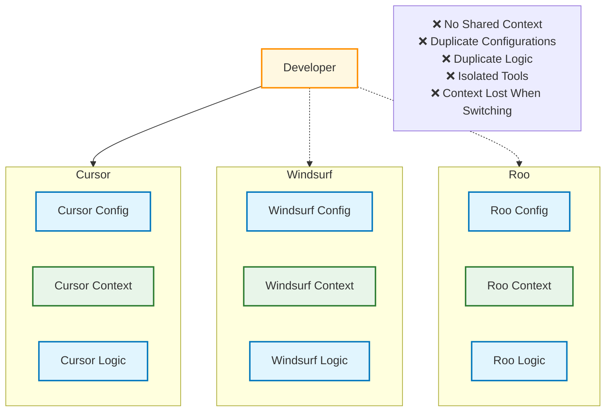
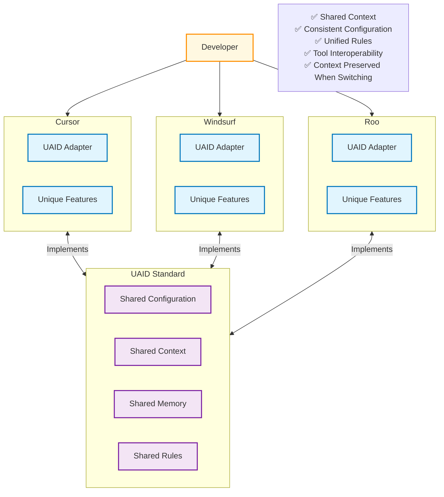
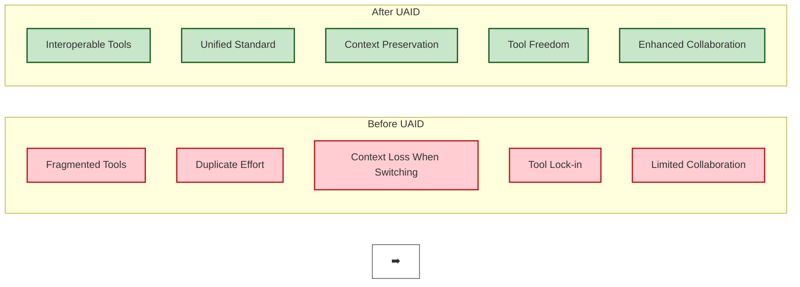
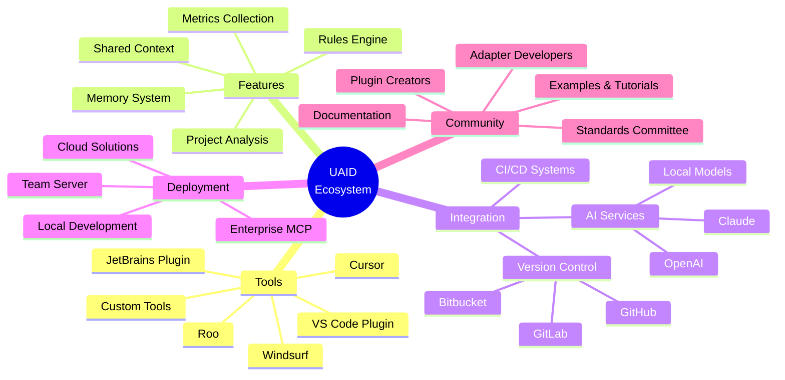
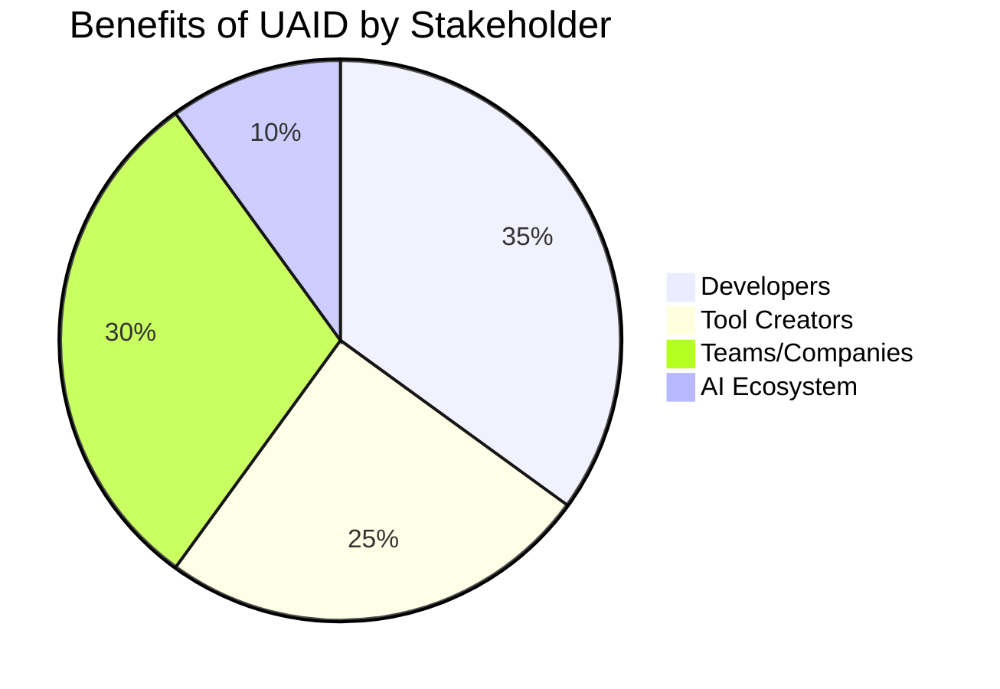
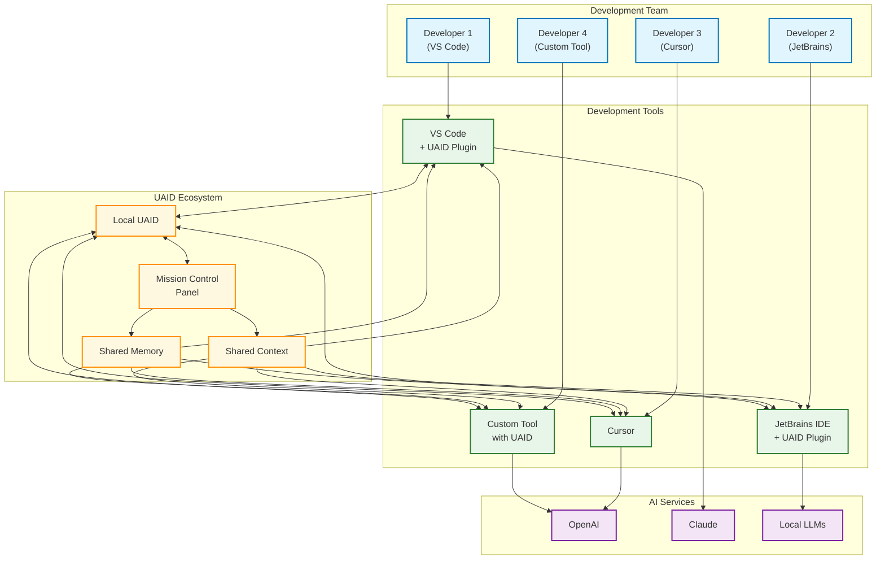
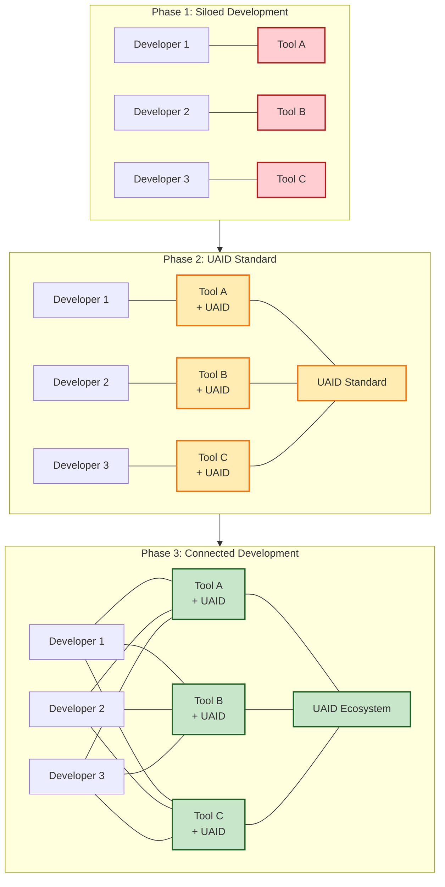

# UAID Vision Diagrams

These diagrams illustrate the vision and goals of the UAID project.

## Current Problem: Fragmented AI Development Tools

## UAID Solution: Unified Standard

## Before & After UAID

## UAID Ecosystem Vision

## UAID Benefits by Stakeholder

## Long-Term Vision: Connected Development

## From Siloed to Connected Development

