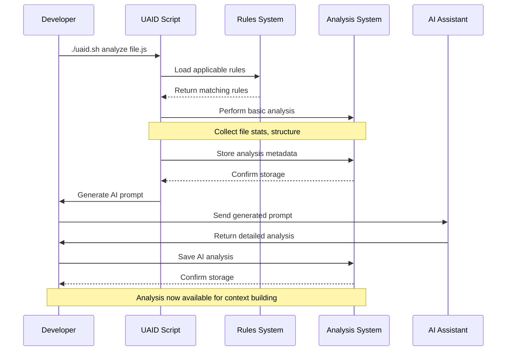
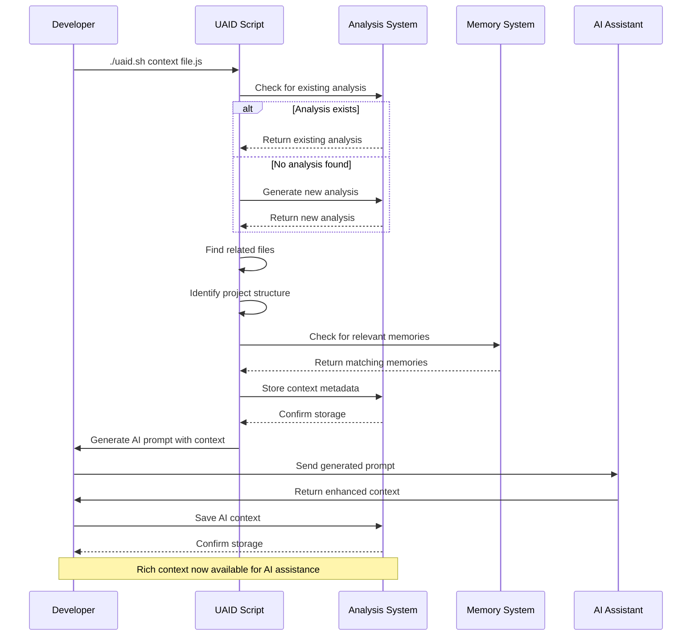
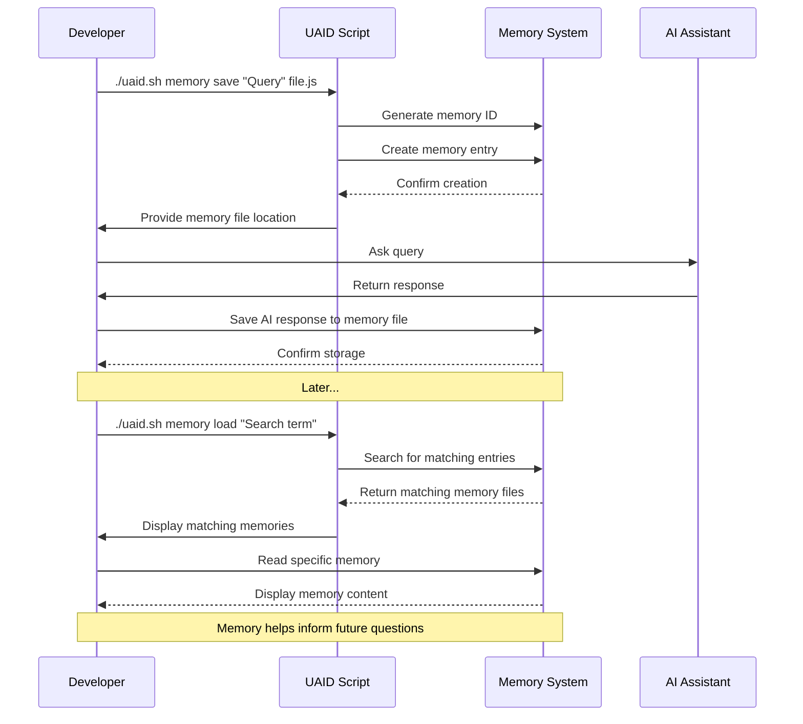
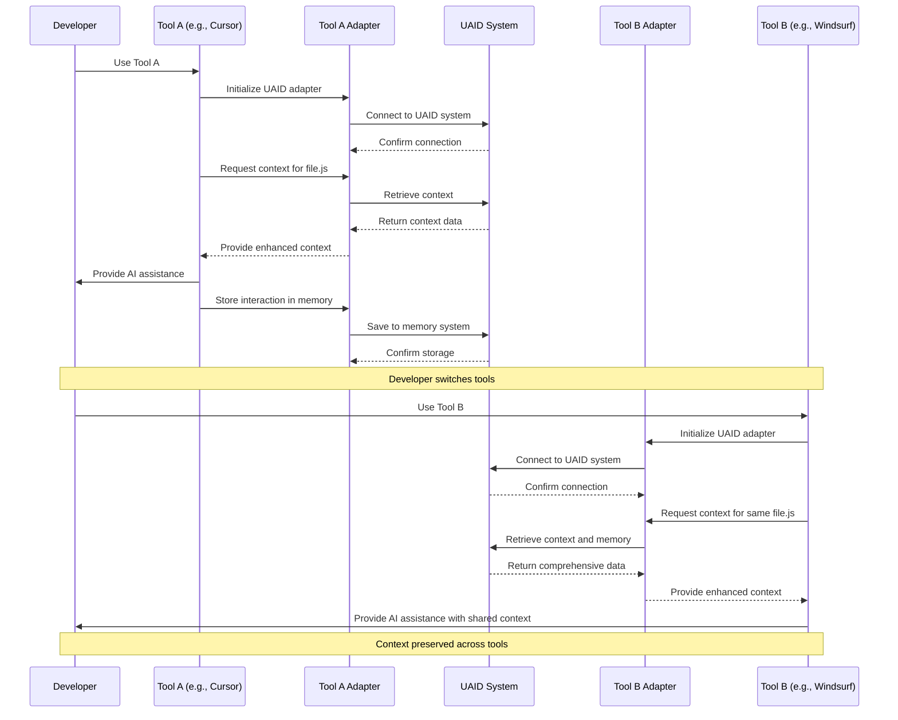
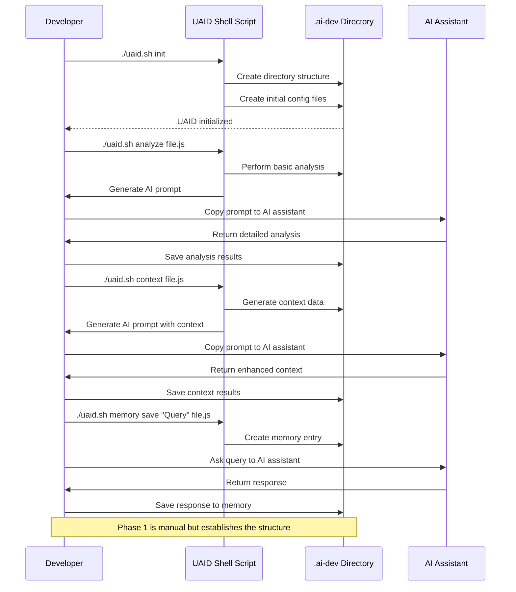

# UAID Workflow Diagrams

This file contains Mermaid diagrams illustrating various UAID workflows.

## Code Analysis Workflow {#code-analysis}

## Context Building Workflow {#context-building}

## Memory Management Workflow {#memory-management}

## Tool Integration Workflow {#tool-integration}

## Phase 1 Implementation Workflow

